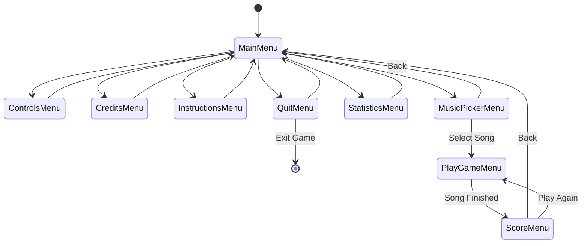
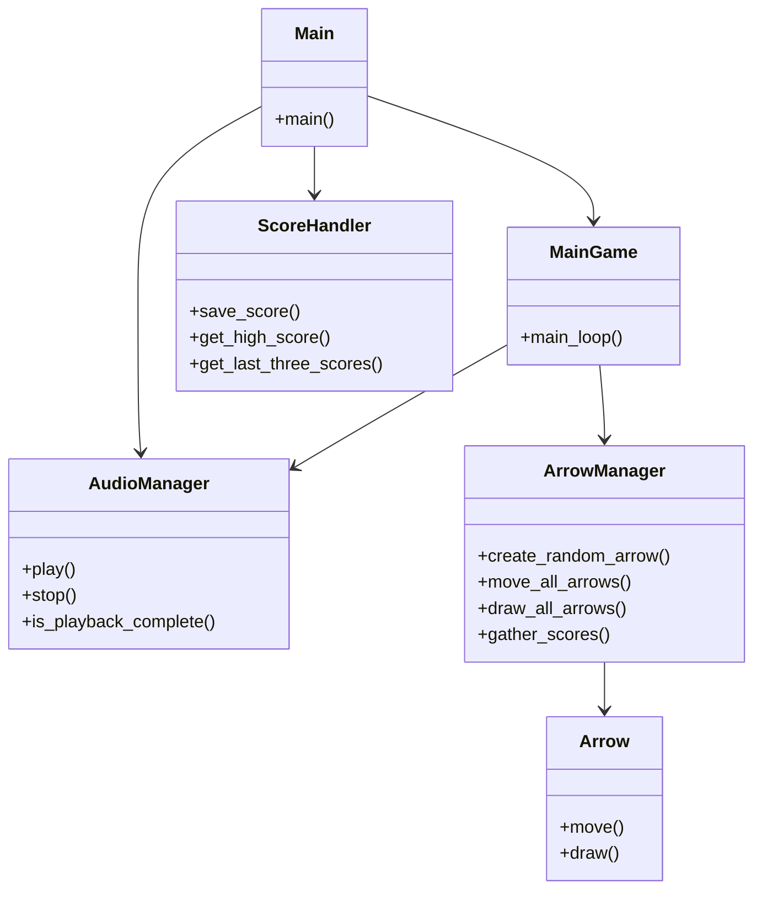

# Rhythm Game

A comprehensive rhythm-based game built with C++ for the ENGR 1281.01H Final Project. The game features dynamic arrow generation, music synchronization, score tracking, and a full-featured menu system.

## Project Overview

The Rhythm Game is a C++ application that challenges players to match incoming arrow patterns in sync with background music. It utilizes a custom graphics and utility library (FEH) along with the Tigr graphics library for cross-platform rendering and Miniaudio for high-quality audio playback.

### Key Features

*   **Dynamic Gameplay**: Arrows move from the bottom to the top of the screen with increasing velocity and frequency as the game progresses.
*   **Music Selection**: Multiple tracks to choose from, each with its own background info and metadata.
*   **Score System**: Persistent score tracking that saves high scores and the last three game sessions.
*   **Animated Visuals**: Dance animations that react to player input and a credit sequence rendered as a video-like sequence of frames.
*   **Comprehensive Menus**: Includes Main Menu, Instructions, Controls, Statistics, and a Music Picker.

## System Architecture

The project follows a modular architecture with a central state machine managing the transition between various menus and the core gameplay loop.

### State Machine

The game transitions through different states represented by the `Menus` enumeration.



### Component Structure

The codebase is divided into several logical components:

*   **Gameplay**: Manages the core game loop, arrow generation, movement, and scoring.
*   **Menu**: Handles the UI rendering and user input for all menu screens.
*   **Util**: Provides utility functions for audio management, persistent storage, and specialized animations.
*   **Lib**: Contains external and platform-specific libraries (FEH, Tigr, Miniaudio).



## Project Structure

```
.
├── assets/             # Game assets (images, audio, animations)
│   ├── arrows/         # Arrow sprites
│   ├── audio/          # Background music and sound effects
│   ├── credits/        # Animation frames for credits
│   ├── dance/          # Animation frames for the dancer
│   ├── info/           # Song metadata images
│   ├── menus/          # UI backgrounds and buttons
│   └── numbers/        # Font assets for score display
├── src/                # Source code
│   ├── gameplay/       # Core game logic and mechanics
│   ├── lib/            # External and helper libraries
│   ├── menu/           # Menu state implementations
│   ├── util/           # Utilities (Audio, Input, Constants)
│   └── main.cpp        # Application entry point
├── CMakeLists.txt      # Build configuration
└── README.md           # Project documentation
```

## Core Mechanics

### Arrow Management
The `ArrowManager` class is responsible for spawning arrows at random intervals. Each arrow has a direction (Left, Up, Down, Right) and moves vertically. The game tracks which arrows are "hittable" based on their proximity to the target zone.

### Scoring
Points are awarded when the player presses the correct key while an arrow is within the scoring threshold. The `ScoreHandler` persists these results to a local file (`scores.dat`), allowing the game to display historical performance.

### Difficulty Scaling
As the song progresses, the game increases the `velocity` of the arrows and decreases the `delay` between arrow generations, providing a natural difficulty curve.

## Building and Running

### Prerequisites
*   CMake (3.29 or higher)
*   C++20 Compiler
*   OpenGL and X11 development libraries (on Linux)

### Build Instructions
1.  Generate build files:
    ```bash
    cmake -B build
    ```
2.  Compile the project:
    ```bash
    cmake --build build
    ```
3.  Run the executable:
    ```bash
    ./build/game
    ```

## Development

The project adheres to strict C++20 standards and uses a clean, class-based architecture to separate concerns between rendering, logic, and data management.